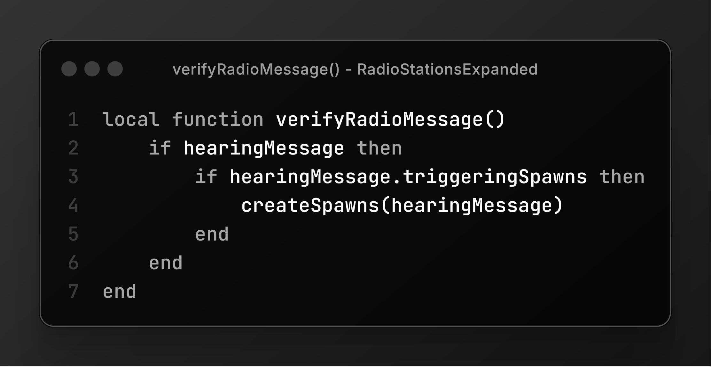

# Radio Stations Expanded 📡🧟

 

> [!NOTE]  
> Tune in for **survival and stories**! This mod brings custom radio broadcasts to life with a chance for loot.

## About
Radio Stations Expanded is a mod for Project Zomboid that adds a new radio channel, "Community Radio Frequency" at 88.0 MHz. It broadcasts immersive messages that enrich the game’s lore—some hint at loot locations, while others paint haunting tales of survival. Get ready to listen, explore, and survive!

## Features ✨
- **New Channel** 📻: "Community Radio Frequency" at 88.0 MHz with survivor broadcasts.  
- **Loot Drops** 🎁: Messages may reveal coordinates for items like guns, tools, or medical supplies.  
- **Story Vibes** 📖: 80% of messages are atmospheric, no-loot stories for immersion.  
- **Daily Airtime** ⏰: Tune in at 10 AM game time for fresh broadcasts.  

## Installation 🛠️
1. Grab the latest version from [GitHub Releases](hhttps://github.com/willmayrink/RadioStationsExpanded).  
2. Unzip the files into your Project Zomboid mods folder (`C:\Users\YourName\Zomboid\mods`).  
3. Activate the mod in the game’s mod menu.  
4. Load or start a game—let the airwaves guide you!  

## How to Play 🎮
- **Tune In**: Set your radio to 88.0 MHz.  
- **Listen Up**: Catch broadcasts at 10 AM—some give loot coordinates!  
- **Hunt**: Head to the coordinates to snag the goods and boost your survival.  

## Demo 🎥
### Survivor’s First Broadcast  
Check it out:  
  

## Contribute 🤝
Love the mod? Help make it better!  
1. Fork the repo.  
2. Branch out (`git checkout -b feature/awesome-idea`).  
3. Commit your magic (`git commit -m 'Added cool stuff'`).  
4. Push it (`git push origin feature/awesome-idea`).  
5. Submit a pull request!  

## Bugs? Ideas? 🐛💡
Spot something off? Got a wild idea? Drop it on the [GitHub Issues](https://github.com/yourusername/radio-stations-expanded/issues) page.  

## License 📜
Released under the GPL 3 License. See [LICENSE](LICENSE) for details. 

---

# Estações de Rádio Expandidas 📡🧟

  

> [!NOTE]  
> Sintonize para **sobrevivência e histórias**! Este mod dá vida a transmissões de rádio personalizadas com chance de saque.

## Sobre
Estações de Rádio Expandidas é um mod para Project Zomboid que adiciona um novo canal de rádio, "Frequência de Rádio da Comunidade" em 88,0 MHz. Ele transmite mensagens imersivas que enriquecem a história do jogo—algumas indicam locais de saque, enquanto outras contam histórias assombrosas de sobrevivência. Prepare-se para ouvir, explorar e sobreviver!

## Recursos ✨
- **Novo Canal** 📻: "Frequência de Rádio da Comunidade" em 88,0 MHz com transmissões de sobreviventes.  
- **Saque** 🎁: Mensagens podem revelar coordenadas de itens como armas, ferramentas ou suprimentos médicos.  
- **Histórias** 📖: 80% das mensagens são atmosféricas, sem saque, para imersão.  
- **Horário Diário** ⏰: Sintonize às 10h do horário do jogo para novas transmissões.  

## Instalação 🛠️
1. Baixe a versão mais recente em [Lançamentos do GitHub](hhttps://github.com/willmayrink/RadioStationsExpanded).  
2. Descompacte os arquivos na pasta de mods do Project Zomboid (`C:\Users\SeuNome\Zomboid\mods`).  
3. Ative o mod no menu de mods do jogo.  
4. Carregue ou inicie um jogo—deixe as ondas de rádio te guiarem!  

## Como Jogar 🎮
- **Sintonize**: Ajuste seu rádio para 88,0 MHz.  
- **Ouça**: Fique atento às transmissões às 10h—algumas dão coordenadas de saque!  
- **Explore**: Vá até as coordenadas para pegar os itens e aumentar suas chances de sobrevivência.  

## Demonstração 🎥
### Primeira Transmissão de Sobrevivente  
Veja em ação:  
  

## Contribua 🤝
Gostou do mod? Ajude a melhorá-lo!  
1. Faça um fork do repositório.  
2. Crie uma branch (`git checkout -b feature/ideia-incrivel`).  
3. Commit suas mudanças (`git commit -m 'Adicionei algo legal'`).  
4. Envie a branch (`git push origin feature/ideia-incrivel`).  
5. Abra um pull request!  

## Problemas? Ideias? 🐛💡
Viu algo estranho? Tem uma ideia genial? Registre na página de [Issues do GitHub](https://github.com/yourusername/radio-stations-expanded/issues).  

## Licença 📜
Lançado sob a Licença GPL 3. Veja [LICENSE](LICENSE) para detalhes.