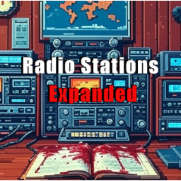

# Radio Stations Expanded 📡💀


> [!IMPORTANT]
> _This is a mod about_ **lore/immersion**; _it doesn't add new functionalities to the game, not yet..._

## **Possible next features**
- [ ] `Messages` _Create more messages presets and think of immersion ideas_
- [ ] `Interactions` _Consider the idea of interactions between "fake" NPCs_
- [ ] `Loot oriented` _Might add a functionality that uses player's looted items to give specific directions or informations_
- [ ] `Reactions` _Make the player react to messages_

```java
System.out.println("Please, kill me.")
```


